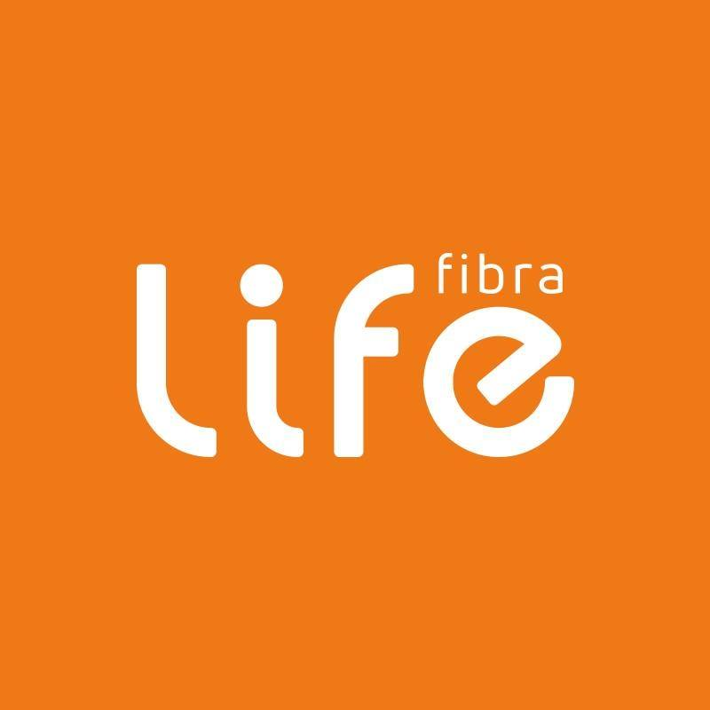

## Concurso Sars-CoV-2 :hospital: 


:star: De uma estrela - Isto ajuda !

Devido aos avanços da COVID-19 as unidades públicas de atendimento na cidade de Marília não conseguiram adaptar seus registros de casos de forma tecnologica e rápida.

Sabendo-se disto a **Life Tecnologia, ASSERTI, UNIVEM e a Secretária de Saúde de Marília** resolveram propor este concurso com o objetivo de reunir alunos regularmente matriculados em cursos de nível superior ou técnico da área de Tecnologia da Informação, para desenvolverem soluções e ferramentas que auxiliem as unidades públicas de atendimento a registrarem os casos da pandemia.

### Objetivos :100:

Além de propor uma solução para a Secretaria da Saúde no municipio todas as soluções que forem criadas durante o concurso serão publicas no GitHub.

```markdown
Lorem ipsum dolor sit amet, consectetur adipiscing elit

# Header 1
## Header 2
### Header 3

- Lorem ipsum dolor sit amet, consectetur adipiscing elit
- Lorem ipsum dolor sit amet, consectetur adipiscing elit

1. Lorem ipsum dolor sit amet, consectetur adipiscing elit
2. Lorem ipsum dolor sit amet, consectetur adipiscing elit

**Bold** and _Italic_ and `Code` text

[Link](url) and 
```

A equipe vencedora ficará com os nomes dos integrantes no README do concurso e no webite [ASSERTI CONCURSO COVID](https://guides.github.com/features/mastering-markdown/).

### Como irá acontecer? :calendar:

As soluções serão publicadas aqui no GitHub após o prazo final da entrega, vale lembrar que é improtante que o source code seja publicado no git ou em qualquer outra platafoma. As avaliações dos códigos ocorrerão por aqui, em caso de DB será necessário que a equipe compartilhe em uma conferência a arquitetura feita.

### Vencedores :tada:

A publicação dos vencedores será feita no WebSite da ASSERTI e no GitHub no dia ....., vale lembrar que os vencedores são aqueles que fizerem mais pontos

### Pontuação :memo:

- Atender os requisitos do software - 0 a 30 pontos
- Padrões de desenvolvimento de software - 0 a 20 pontos
- Interface Front-end do software - 0 a 20 pontos
- Dashboard de informações analíticas - 0 a 20 pontos
- Normalização e padrão do esquema do banco de dados - 0 a 10 pontos

### Premiação :trophy:

A premiação será direcionada para a equipe vencedora que tiver a maior pontuação.
- Premio de R$ 2.000,00 para a equipe (**Patrocínio da empresa Life**)
- Certificado de honra ao mérito concedido pela ASSERTI
-

### Suporte e Contato :e-mail:	

Está tendo problemas? Entre em contato conosco [contato](https://help.github.com/categories/github-pages-basics/) ou [pelo site](https://github.com/contact) nós iremos te ajudar com seus problemas.

### Apoiadores 🤝

<div align="center">
  
  
  
  

</div>
